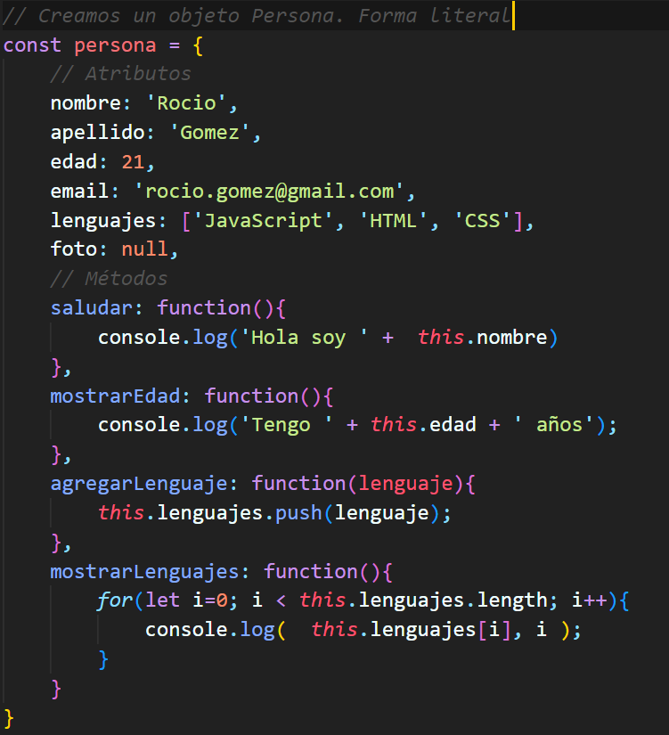

🎯 Temas

1. Objetos Definición
2. Propiedades
3. Métodos
4. DOM: Document Object Model
5. QuerySelector
6. InnerHTML
7. InnerText

``` js
const persona = {
    // Atributos
    nombre: 'Rocio',
    apellido: 'Gomez',
    edad: 21,
    email: 'rocio.gomez@gmail.com',
    lenguajes: ['JavaScript', 'HTML', 'CSS'],
    foto: null,
    // Métodos
    saludar: function(){
        console.log('Hola soy ' +  this.nombre)
    },
    mostrarEdad: function(){
        console.log('Tengo ' + this.edad + ' años');
    },
    agregarLenguaje: function(lenguaje){
        this.lenguajes.push(lenguaje);
    },
    mostrarLenguajes: function(){
        for(let i=0; i < this.lenguajes.length; i++){
            console.log(  this.lenguajes[i], i );
        }
    }
}
```
---


