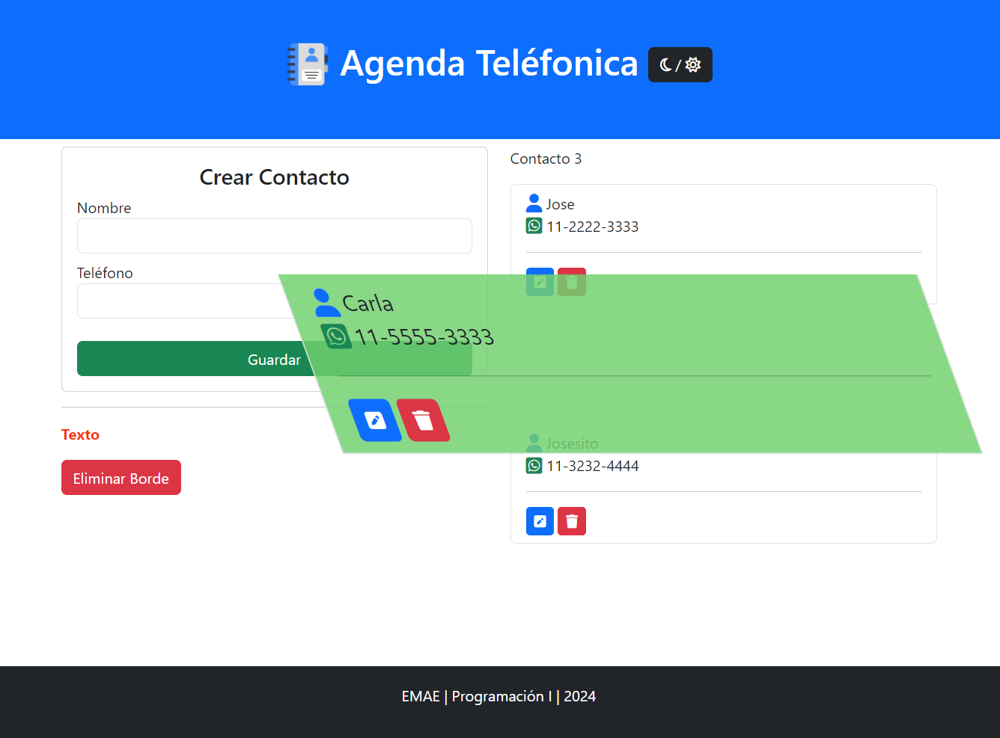

🎯 Temas

1. DOM
2. Renderizado de listas
3. Eventos
4. Formularios

``` js
function redenrizarTareas(tareas){
    // Limpio el contenedor
    listTareas.innerHTML = '';
    // Recorre el array y crea por cada elemento una <li>
    for (let i = 0; i < tareas.length; i++) {
        const tarea = tareas[i];
        // template string ``
        listTareas.innerHTML += 
            `<li class="list-group-item">
                <i class="fa-regular fa-clock"></i> ${tarea}
            </li>`;
    }
}
```
---

``` js
// Escucho el evento del formulario submit
form.addEventListener('submit', function(evento){
    evento.preventDefault(); // Evita la recarga de la página
    let tarea = textTarea.value; // leo el valor del textarea
    if( tarea == ''){  // Validamos si el usuario ingreso un texto
        textError.innerText = 'Complete este campo, que es obligatorio';
        //alert('ingresar la tarea');
    } else {
        console.log(tarea);
        tareas.push( tarea);
        textTarea.value = ''; // limpio el valor del textarea
        redenrizarTareas(tareas);
    }

})
```


